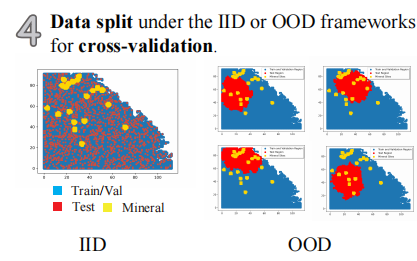

Introduction
============

Automated System for MPM
-------------------------

AutoMPM is a tool developed for automatic machine learning in Mineral Persepective Mapping field. It's a both user-friendly and efficient python-based tool.

.. image:: workflow.png
   :align: center
   :width: 500px  

AutoMPM stands as an innovative solution, purposefully crafted to revolutionize the landscape of mineral prospectivity mapping (MPM) through automated machine learning. In the realm of mineral resource exploration, MPM serves as a cornerstone, pinpointing locales with elevated potential for distinct mineral deposits. Traditionally, these endeavors demanded laborious, hands-on techniques, characterized by protracted timelines and susceptibility to inherent human inclinations. AutoMPM ushers in a paradigm shift, offering an advanced toolset that streamlines and refines this process with cutting-edge automation.

Code Files
^^^^^^^^^^^

Code structure of AutoMPM:

- ``optimization.py``: Bayesian optimization
- ``constraints.py``: Encapsulation of hyperparameter settings
- ``model.py``: The model of auto machine learning algorithm
- ``algo.py``: Encapsulation of algorithms
- ``method.py``: Automatically select the algorithm
- ``utils.py``: Some tool functions
- ``data_preprocess.py``: Data pre-process
- ``metric.py``: Shapley value tool
- ``interpolation.py``: The optimization for interpolation
- ``test.py``: The template code to run

Tutorial: AutoMPM User Guide
=============================

Introduction
------------

Welcome to the AutoMPM user guide, where we delve into the efficient and automated world of Mineral Prospectivity Mapping (MPM). AutoMPM is designed to streamline the MPM process, leveraging advanced machine learning techniques to uncover high-potential mineral deposits. Say goodbye to manual, time-consuming methods and embrace a future of accelerated insights and reduced biases.

Preprocessing Data
------------------

Navigate the preprocessing phase with finesse, utilizing the functions found in the ``data_preprocess.py`` module:

- ``preprocess_data``: Standard function for raw data preprocessing.
- ``preprocess_all_data``: Preprocess raw data across all datasets, excluding *Washington*.
- ``preprocess_data_interpolate``: Special preprocessing for the *Washington* dataset.

Algorithmic Predictions
-----------------------

The heart of AutoMPM lies in its algorithmic predictions. Discover the standard class structure for encapsulating gold mine prediction algorithms:

- ``__init__(self, params)``: Initialize the algorithm with parameters, unpacking them to the super class.
- ``predicter(self, X)``: Unveil 2-class results and probability predictions for sample classifications.

Hyperparameter Constraints
--------------------------

AutoMPM ensures sound hyperparameter tuning by adhering to these constraints:

- Continuous Param: Lower and upper bounds as a floating-point list of length 2.
- Discrete Param: Lower and upper bounds as an integer list of length 2.
- Categorical Param: Enumeration of feasible options within a list.
- Static Param: A static value serving as a constant.

Getting Started
---------------

Prepare to embark on your AutoMPM journey by following these steps:

1. **Preprocessing**: Use the functions in ``data_preprocess.py`` to preprocess your raw data effectively.

2. **Hyperparameter Mastery**: Understand the constraints governing hyperparameter tuning.

3. **Run the Code**: Before executing the system, ensure you update the file path in ``test.py``.

4. **Check the Output**: The output will be recorded in a *.md* file in *run* folder.

By embracing the AutoMPM toolkit, you'll empower your mineral prospectivity mapping endeavors with automation, precision, and enhanced insights. Let AutoMPM be your guide to a new era of efficient exploration.

Bayesian Optimization in AutoMPM
============================

.. image:: fig2.png
   :align: center
   :width: 500px  

Optimization Logic
------------------

The logic workflow of hyperparameter optimization in ``optimization.py``.

- Automatically choose the best hyperparameters for the machine learning algorithm.
- Multi-processing on multiple threads to accelerate the predicting process. Simultaneously evaluate multiple parameters in parallel, aggregate and proceed to the next iteration.
- Employing a multi-fidelity strategy, an initial low-fidelity estimation is conducted using a weighted cross-entropy metric. If performance surpasses a set threshold, a high-fidelity estimation is executed for refinement.

Process of Hyperparameters
^^^^^^^^^^^^^^^^^^^^^^^^^^

The format of hyperparameters that input, store, and use in ``optimization.py``.

- Change the input of hyperparameter info into a fully dict-like format, as:
  - ``param_name``: {
    - ``type``: Enum(continuous,discrete,enum,static)
    - ``low``: float or int
    - ``high``: float or int
    - ``member``: IntEnum(#member)
    - ``value``: float or int
    - }

- An encapsulated function for checking the format of hyperparameter info
  - Whether in the params of the algorithm
  - Continuous and discrete: low and high
  - Enum: member
  - Static: value

- An encapsulated function for translating between hyperparameter info and value type
  - Continuous to uniform
  - Discrete and enum to randint

IID & OOD
^^^^^^^^^

- Two data split ways that suitable for different situations:

  - (IID) Split by random-split strategy.
  - (OOD) Split by K-Means clustering algorithm with a scheme to choose a certain start point of generating subarea to cover all splitting scenarios with fewer trials.

Algorithms
^^^^^^^^^^

The algorithms to build a model for mine prediction.

- More encapsulated algorithms and corresponding default hyperparameters in ``algo.py``:

  - Logistic Regression (LGR)
  - Neural Network (NN)
  - Support Vector Machine (SVM)
  - Random Forest (RF)
  - Extra Trees (ET)
  - Gradient Boosting (GB)
  - Random Forest Boosting (RFB)
  - SVM Boosting (SVMBT)
  - LGR Boosting (LGRBT)
  - SVM Bagging (SVMBG)
  - LGR Bagging (LGRBG)
  - NN Bagging (NNBG)
  - Extreme Gradient Boosting (XGB)
  - Light Gradient Boosting (LGB)

Method Selection and Interpolation Optimization
-----------------------------------------------

Method Selection
^^^^^^^^^^^^^^^^

.. image:: method.png
   :align: center
   :width: 500px  

The selection of different machine learning methods in ``method.py``.

- Evaluate each method with steps in low-fidelity Bayesian Optimization, and choose the best one with the best performance.

Interpolation Optimization
^^^^^^^^^^^^^^^^^^^^^^^^^^

.. image:: interp.png
   :align: center
   :width: 500px  

The selection of different interpolation strategies in ``method.py``.

- ``scipy.interpolate.interp2d`` with interpolation kinds of ['linear', 'cubic', 'quintic'].
- Kriging interpolation with interpolation kinds of ["linear", "gaussian", "exponential", "hole-effect"].

Automated selection entails favoring the method characterized by the minimal Mean Squared Error (MSE) loss value, thus designating it as the introductory technique of choice.
