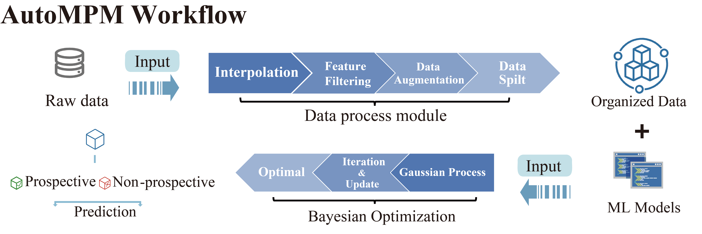
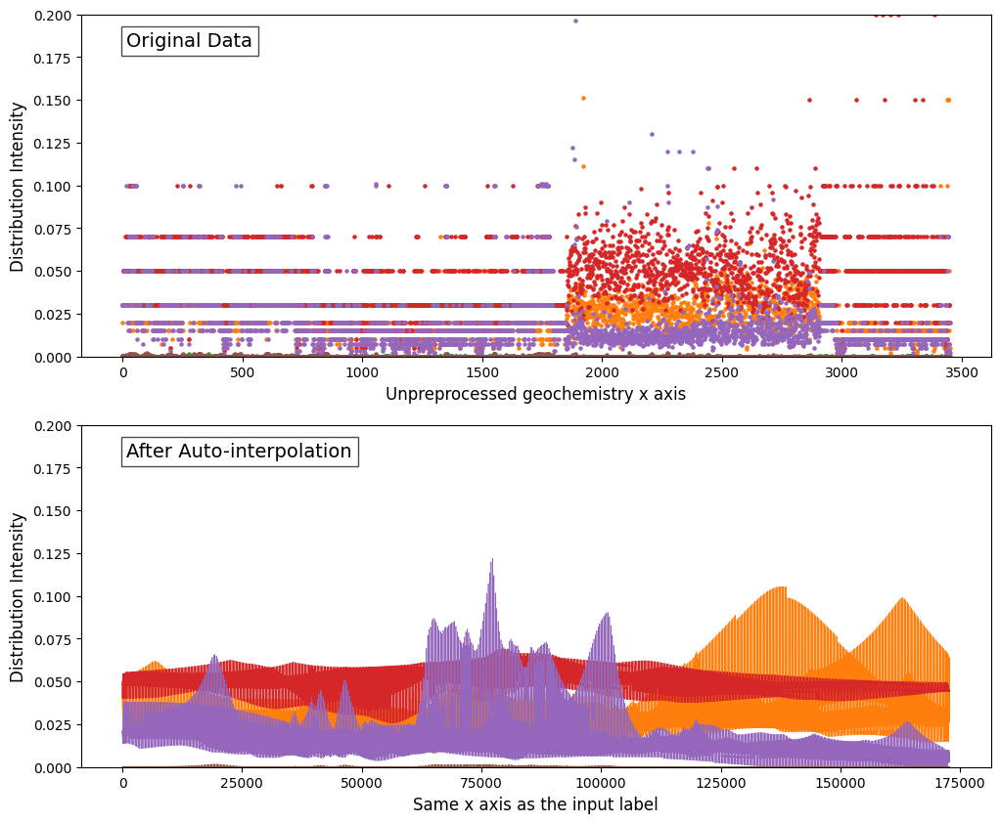
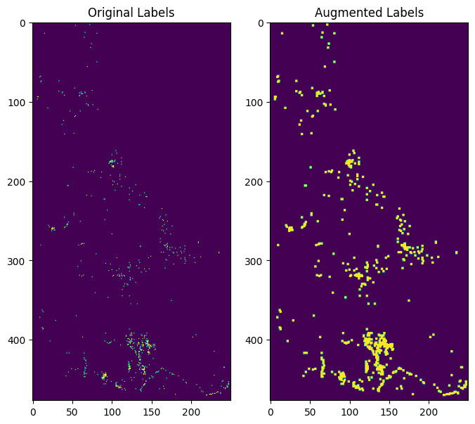

Introduction
============

Automated System for MPM
-------------------------

AutoMPM is a tool developed for automatic machine learning in Mineral Prospective Mapping (MPM). It provides user-friendly python-based interface for MPM.



AutoMPM stands as an innovative solution, purposefully crafted to revolutionize the landscape of MPM through automated machine learning. In the realm of mineral resource exploration, MPM serves as a cornerstone, pinpointing locales with elevated potential for distinct mineral deposits. Traditionally, these endeavors demanded laborious, hands-on techniques, characterized by protracted timelines and susceptibility to inherent human inclinations. AutoMPM ushers in a paradigm shift, offering an advanced toolset that streamlines and refines this process with cutting-edge automation.


AutoMPM User Guide
==================

Welcome to the AutoMPM user guide, where we delve into the efficient and automated world of Mineral Prospectivity Mapping (MPM). AutoMPM is designed to streamline the MPM process, leveraging advanced machine learning techniques to uncover high-potential mineral deposits. Say goodbye to manual, time-consuming methods and embrace a future of accelerated insights and reduced biases.

Pre-processing Dataset 
----------------------


Navigate the preprocessing phase with finesse, utilizing the functions found in the ``data_preprocess.py`` module:

- ``preprocess_data``: Standard function for raw data preprocessing.
- ``preprocess_all_data``: Preprocess raw data across all datasets, excluding *Washington*.
- ``preprocess_data_interpolate``: Special preprocessing for the *Washington* dataset.

Mineral exploration datasets encompass geological, geophysical, geochemical, remote sensing, and drilling data, characterized by various types, scales, file sizes, non-stationarity, and heterogeneity. Given this diversity, autoMPM will consider and process both physical and chemical assessments such as gravity information and heat-map of chemical elements. 


Here we extract the mask and features of Idaho dataset by reading all the corresponding file:

.. code-block:: python

    # Load feature geochemical data
    feature_dict = {}
    for feature in feature_list:
        rst = rasterio.open(data_dir + f'/{feature_prefix}{feature}{feature_suffix}')
        feature_dict[feature] = rst.read(1)
        
    # Load mask raw data and preprocess
    mask_ds = rasterio.open(data_dir + f'/{mask}').read(1)
    mask = make_mask(data_dir, mask_data)
    
    # More features added and filtered 
    if feature_filter:
        dirs = os.listdir(data_dir + '/TIFs')
        for feature in dirs:
            if 'tif' in feature:
                if 'toline.tif' in feature:
                    continue
                rst = rasterio.open(data_dir + '/TIFs/' + feature).read(1)
                if rst.shape != mask.shape:
                    continue
                feature_list.append(feature)
                feature_dict[feature] = np.array(rst)

And process the labels by dealing the ''common_main'' in deposite files:

.. code-block:: python

    # Load label raw data
    label_x_list = []
    label_y_list = []
    for path in label_path_list:
        deposite = geopandas.read_file(data_dir + f'/{path}')
        
        # Whether to filter label raw data
        if label_filter:
            deposite = deposite.dropna(subset='comm_main')
            au_dep = deposite[[target_name in row for row in deposite['comm_main']]]
        else:
            au_dep = deposite
        
        # Extract the coordinate
        label_x = au_dep.geometry.x.to_numpy()
        label_y = au_dep.geometry.y.to_numpy()


Moreover, 4 stages are included in the further data pre-processing pipeline: auto-interpolation, feature filtering, data enhancement and data split.

Auto-Interpolation
^^^^^^^^^^^^^^^^^^



The selection of different interpolation strategies in ``method.py``.

- ``scipy.interpolate.interp2d`` with interpolation kinds of ['linear', 'cubic', 'quintic'].
- ``pykrige.OrdinaryKriging`` with interpolation kinds of ["linear", "gaussian", "exponential", "hole-effect"].

.. note::

    Only some datasets need interpolation process and Idaho does not need that. AutoMPM will judge automaticall weather it is required for interpolation.

.. code-block:: python
    
    # pre-process the x-y grid that we have to do interpolation
    x_geo, y_geo = geochemistry.geometry.x.values, geochemistry.geometry.y.values
    x_max, y_max = mask_ds.index(mask_ds.bounds.right, mask_ds.bounds.bottom)
    z = geochemistry[feature].values
    
    # interpolation optimization
    interpOPT = interp_opt()
    result = interpOPT.optimize(x_geo, y_geo, z, x_max, y_max)


Automated selection entails favoring the method characterized by the minimal Mean Squared Error (MSE) loss value or the performance metric sore (F1 score etc.), thus designating it as the introductory technique of choice. The default choose criterion is MSE loss.

Feature Filtering
^^^^^^^^^^^^^^^^^

.. image:: filtering.png
   :align: center
   :width: 400px  

There will be an automated two-tier screening workflow has been devised. In the first tier, the system filters the features based on their Pearson coefficient with the training labels. In the second tier, the system employs Shapley values, which provide a measure of the contribution of each feature to the overall model performance.

- ``Feature_Filter.get_shapely`` a highly integrated function that output the Shapley vlaue with assistance of a random forest classifier.
- ``Feature_Filter.select_top_features`` automatically select the top-k features. k is set default to 20. 

.. code-block:: python

    feature_filter_model = Feature_Filter(input_feature_arr=feature_arr)
    feature_arr = feature_filter_model.select_top_features(top_k=20)


Data Enhancement
^^^^^^^^^^^^^^^^


Data augmentation was employed to expand each ore spot from a single point to a mxm area, which allows for a more comprehensive representation of the ore distribution, capturing the spatial context and potential variations within the surrounding area.

- ``augment_2D`` assign the m*m blocks around the sites to be labeled. m is set default to 3.

.. code-block:: python
    
    # save the original label for test set
    ground_label_arr = label2d[mask]  

    # data enhancement
    label_arr2d = augment_2D(label_arr2d)
    label_arr = label_arr2d[mask]


Data Split
^^^^^^^^^^


- Two data split ways that suitable for different situations:

  - (IID) Split by random-split strategy.
  - (OOD) Split by K-Means clustering algorithm with a scheme to choose a certain start point of generating subarea to cover all splitting scenarios with fewer trials.


- ``random_split`` for IID case. Split the dataset into train set and test set, and apply K-fold Cross-validation.
- ``dataset_split`` for OoD case. Split the dataset using K-means clustering, as in ``test_extend`` that generate the mask of test dataset.

.. code-block:: python

    # IID
    if self.mode == 'random':
        dataset_list = self.random_split(modify=self.modify)
    # OoD    
    else:
        test_mask, dataset_list = self.dataset_split(test_mask, modify=True)


.. note::

    The data split operation is typically executed in the predicting stage, but for the purpose of this code example, it is included as a pre-processing module.


After all the pre-processing stages, the raw data will be packed in a *.pkl* file:

.. code-block:: python

    # Pack and save dataset.
    dataset = (feature_arr, np.array([ground_label_arr, label_arr]), mask, deposite_mask)
    with open(output_path, 'wb') as f:
        pickle.dump(dataset, f)


Algorithmic Predictions
-----------------------

Bayesian Optimization Auto-ML system
^^^^^^^^^^^^^^^^^^^^^^^^^^^^^^^^^^^^
After pre-processing we directly input the data package into the automatic system. It's driven by Bayesian Optimization which will choose and optimize and best algorithm and corresponding hyperparameters. Here we adopt a parallel and multi-fidelity accelerated design in our auto system.


The output of AutoMPM lies cames from its algorithmic predictions. Discover the standard class structure for encapsulating gold mine prediction algorithms:

.. code-block:: python

    class rfcAlgo(RandomForestClassifier):
        DEFAULT_CONTINUOUS_BOOK = {}
        DEFAULT_DISCRETE_BOOK = {'n_estimators': [10, 150], 'max_depth': [10, 50]}
        DEFAULT_ENUM_BOOK = {'criterion': ['gini', 'entropy']}
        DEFAULT_STATIC_BOOK = {} 

        def __init__(self, params):
            super().__init__(**params)
            self.params = params

        def predictor(self, X):

            pred = self.predict(X)
            y = self.predict_proba(X)
            if isinstance(y, list):
                y = y[0]
            return pred, y[:,1]


- ``__init__(self, params)``: Initialize the algorithm with parameters, unpacking them to the super class.
- ``predictor(self, X)``: Unveil 2-class results and probability predictions for sample classifications.

Hyperparameter Constraints
^^^^^^^^^^^^^^^^^^^^^^^^^^

AutoMPM ensures sound hyperparameter tuning by adhering to these constraints:

- Continuous Param: Lower and upper bounds as a floating-point list of length 2.
- Discrete Param: Lower and upper bounds as an integer list of length 2.
- Categorical Param: Enumeration of feasible options within a list.
- Static Param: A static value serving as a constant.

Example Use
^^^^^^^^^^^
.. code-block:: python

    # Automatically decide an algorithm
    algo_list = [rfcAlgo, extAlgo, svmAlgo, NNAlgo, gBoostAlgo]
    method = Method_select(algo_list)
    algo = method.select(data_path=path, task=Model, mode=mode)
    print(f"\n{name}, Use {algo.__name__}")

    # Bayesian optimization process
    bo = Bayesian_optimization(
        data_path=path, 
        algorithm=algo, 
        mode=mode,
        metrics=['f1', 'auc'],
        default_params=True
    )
    
    x_best = bo.optimize(300, early_stop=50)


Summary
-------

Prepare to embark on your AutoMPM journey by following these steps:

1. **Preprocessing**: Use the functions in ``data_preprocess.py`` to preprocess your raw data effectively.

2. **Hyperparameter Mastery**: Understand the constraints governing hyperparameter tuning.

3. **Run the Code**: Before executing the system, ensure you update the file path in ``test.py``.

4. **Check the Output**: The output will be recorded in a *.md* file in *run* folder.

By embracing the AutoMPM toolkit, you'll empower your mineral prospectivity mapping endeavors with automation, precision, and enhanced insights. Let AutoMPM be your guide to a new era of efficient exploration.


Bayesian Optimization in AutoMPM
================================

.. image:: fig2.png
   :align: center
   :width: 400px  

Optimization Logic
------------------

The logic workflow of hyperparameter optimization in ``optimization.py``.

- Automatically choose the best hyperparameters for the machine learning algorithm.
- Multi-processing on multiple threads to accelerate the predicting process. Simultaneously evaluate multiple parameters in parallel, aggregate and proceed to the next iteration.
- Employing a multi-fidelity strategy, an initial low-fidelity estimation is conducted using a weighted cross-entropy metric. If performance surpasses a set threshold, a high-fidelity estimation is executed for refinement.


- ``data_path``: Specifies the path to the dataset used for optimization.
- ``algorithm``: Specifies the machine learning algorithm or model used for optimization.
- ``mode``: Indicates the optimization mode or strategy.
- ``metrics``: A list of evaluation metrics, including 'f1' (F1 score), 'auc' (Area Under the ROC Curve), 'pre' (precision score), used during optimization.
- ``default_params```: Implies that default hyperparameters are initially used for optimization.

.. code-block:: python

    # Initialization
    X, y, names = self.initialize(x_num)
    if early_stop == 0:
        early_stop = steps
    early_stop_cnt = 0
    
    # Find the best in initialized samples
    best = np.argmax(y)
    y_best = y[best]
    name_best = names[best]
  
    # Optimization iterations                    
    for step_i in range(steps):
        x_sample, name = self.opt_acquisition(X)
        y_ground = self.evaluate_parallel(name, self.worker)
        worker_best = y_ground.argmax()
        name = name[worker_best]
        x_sample = x_sample[worker_best]
        y_ground = y_ground[worker_best]

        # Check whether this is the best score till now
        flag = False
        if y_ground > y_best:
            y_best = y_ground
            name_best = name
            early_stop_cnt = 0
            flag = True
        
        # Early stop
        if not flag:
            early_stop_cnt += 1
            if early_stop_cnt == early_stop:
                break
        else:
            early_stop_cnt = 0
            
        # Update the surrogate function
        self.gaussian.fit(X, y)


Process of Hyperparameters
^^^^^^^^^^^^^^^^^^^^^^^^^^

The format of hyperparameters that input, store, and use in ``optimization.py``.

- Change the input of hyperparameter info into a fully dict-like format, as:
- ``param_name``: {
    - ``type``: Enum(continuous,discrete,enum,static)
    - ``low``: float or int
    - ``high``: float or int
    - ``member``: IntEnum(#member)
    - ``value``: float or int
    - }

- An encapsulated function for checking the format of hyperparameter info
  - Whether in the params of the algorithm
  - Continuous and discrete: low and high
  - Enum: member
  - Static: value

- An encapsulated function for translating between hyperparameter info and value type
  - Continuous to uniform
  - Discrete and enum to randint


Method Selection 
^^^^^^^^^^^^^^^^

.. image:: method.png
   :align: center
   :width: 500px  

The selection of different machine learning methods in ``method.py``.

- Evaluate each method with steps in low-fidelity Bayesian Optimization, and choose the best one with the best performance.

.. code-block:: python

    class Method_select:
        def __init__(self, algorithms=[rfcAlgo, NNAlgo]):
            self.algos = algorithms
            self.best_algo = None
            self.opt_score = -100
    
        def evaluate_algo(self, algo, data_path, task, mode):
            # low-fidelity estimation for method selection
            
            bo = Bayesian_optimization(data_path, task, algo, mode=mode, default_params=True, fidelity=1, worker=3, modify=True)
            best, X, y = bo.optimize(steps=5, out_log=False, return_trace=True)
            score = np.mean(y)
            print(f'{algo.__name__}, score: {score:.4f}')
            return score
    
        def select(self, data_path, task, mode):
    
            with concurrent.futures.ThreadPoolExecutor(max_workers=16) as executor:
                future_to_algo = {executor.submit(self.evaluate_algo, algo, data_path, task, mode): algo for algo in self.algos}
                
                for future in concurrent.futures.as_completed(future_to_algo):
                    algo = future_to_algo[future]
                    try:
                        score = future.result()
                        if score > self.opt_score:
                            self.best_algo = algo
                            self.opt_score = score
                            
                    except Exception as exc:
                        print(f'Error while evaluating {algo.__name__} Model: {exc}')
    
            return self.best_algo


Appendix
========


Algorithms
----------

The algorithms to build a model for mine prediction.

- More encapsulated algorithms and corresponding default hyperparameters in ``algo.py``:

  - Logistic Regression (LGR)
  - Neural Network (NN)
  - Support Vector Machine (SVM)
  - Random Forest (RF)
  - Extra Trees (ET)
  - Gradient Boosting (GB)
  - Random Forest Boosting (RFB)
  - SVM Boosting (SVMBT)
  - LGR Boosting (LGRBT)
  - SVM Bagging (SVMBG)
  - LGR Bagging (LGRBG)
  - NN Bagging (NNBG)
  - Extreme Gradient Boosting (XGB)
  - Light Gradient Boosting (LGB)

Code Files
----------

Code structure of AutoMPM:

- ``optimization.py``: Bayesian optimization
- ``constraints.py``: Encapsulation of hyperparameter settings
- ``model.py``: The model of auto machine learning algorithm
- ``algo.py``: Encapsulation of algorithms
- ``method.py``: Automatically select the algorithm
- ``utils.py``: Some tool functions
- ``data_preprocess.py``: Data pre-process
- ``metric.py``: Shapley value tool
- ``interpolation.py``: The optimization for interpolation
- ``test.py``: The template code to run

.. Essential classes in AutoMPM
.. ----------------------------

.. .. autoclass:: optimization.Bayesian_optimization
..     :members:
..     :undoc-members:
..     :member-order: bysource
..     :show-inheritance:

.. .. autoclass:: model.Model
..     :members:
..     :undoc-members:
..     :member-order: bysource
..     :show-inheritance:

