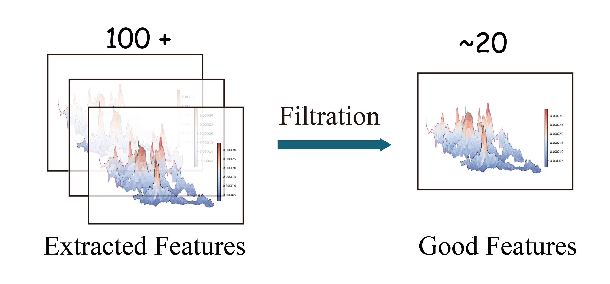
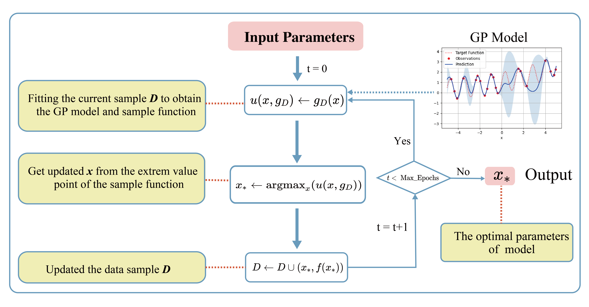

Introduction
============

Automated System for Mineral Prospective Mapping
-------------------------

AutoMPM is a tool developed for automatic machine learning in Mineral Prospective Mapping (MPM). It provides user-friendly python-based interface for MPM.

.. image:: workflow.png
   :align: center
   :width: 500px  

AutoMPM stands as an innovative solution, purposefully crafted to revolutionize the landscape of MPM through automated machine learning. In the realm of mineral resource exploration, MPM serves as a cornerstone, pinpointing locales with elevated potential for distinct mineral deposits. Traditionally, these endeavors demanded laborious, hands-on techniques, characterized by protracted timelines and susceptibility to inherent human inclinations. AutoMPM ushers in a paradigm shift, offering an advanced toolset that streamlines and refines this process with cutting-edge automation.


Tutorial: AutoMPM User Guide
============================

Welcome to the AutoMPM user guide, where we delve into the efficient and automated world of MPM. AutoMPM is designed to streamline the MPM process, leveraging advanced machine learning techniques to uncover high-potential mineral deposits. Say goodbye to manual, time-consuming methods and embrace a future of accelerated insights and reduced biases.

Pre-processing Dataset 
----------------------

Navigate the preprocessing phase with finesse, utilizing the functions found in the ``data_preprocess.py`` module:

- ``preprocess_data``: Standard function for raw data preprocessing.
- ``preprocess_all_data``: Preprocess raw data across all datasets, excluding *Washington*.
- ``preprocess_data_interpolate``: Special preprocessing for the *Washington* dataset.

Mineral exploration datasets encompass geological, geophysical, geochemical, remote sensing, and drilling data, characterized by various types, scales, file sizes, non-stationarity, and heterogeneity. Given this diversity, autoMPM will consider and process both physical and chemical assessments such as gravity information and heat-map of chemical elements. 

.. image:: Nova.png
   :align: center
   :width: 250px  

Moreover, 4 stages are included in the further data pre-processing pipeline: auto-interpolation, feature filtering, data enhancement and data split.

Auto-Interpolation
^^^^^^^^^^^^^^^^^^

.. image:: interp.png
   :align: center
   :width: 400px  

The selection of different interpolation strategies in ``method.py``.

- ``scipy.interpolate.interp2d`` with interpolation kinds of ['linear', 'cubic', 'quintic'].
- ``pykrige.OrdinaryKriging`` with interpolation kinds of ["linear", "gaussian", "exponential", "hole-effect"].

Automated selection entails favoring the method characterized by the minimal Mean Squared Error (MSE) loss value or the performance metric sore (F1 score etc.), thus designating it as the introductory technique of choice. The default choose criterion is MSE loss.

Feature Filtering
^^^^^^^^^^^^^^^^^



There will be an automated two-tier screening workflow has been devised. In the first tier, the system filters the features based on their Pearson coefficient with the training labels. In the second tier, the system employs Shapley values, which provide a measure of the contribution of each feature to the overall model performance.


- ``Feature_Filter.get_shapely`` a highly integrated function that output the Shapley vlaue with assistance of a random forest classifier.
- ``Feature_Filter.select_top_features`` automatically select the top-k features. k is set default to 20. 


Data Enhancement
^^^^^^^^^^^^^^^^
.. image:: enhance.png
   :align: center
   :width: 400px  

Data augmentation was employed to expand each ore spot from a single point to a mxm area, which allows for a more comprehensive representation of the ore distribution, capturing the spatial context and potential variations within the surrounding area.

- ``augment_2D`` assign the m*m blocks around the sites to be labeled. m is set default to 3.

Data Split
^^^^^^^^^^

.. image:: data_split.png
   :align: center
   :width: 400px  

- Two data split ways that suitable for different situations:

  - (IID) Split by random-split strategy.
  - (OOD) Split by K-Means clustering algorithm with a scheme to choose a certain start point of generating subarea to cover all splitting scenarios with fewer trials.


- ``random_split`` for IID case. Split the dataset into train set and test set, and apply K-fold Cross-validation.
- ``dataset_split`` for OoD case. Split the dataset using K-means clustering, as in ``test_extend`` that generate the mask of test dataset.


Algorithmic Predictions
-----------------------

The heart of AutoMPM lies in its algorithmic predictions. Discover the standard class structure for encapsulating gold mine prediction algorithms:

.. code-block:: python

    class rfcAlgo(RandomForestClassifier):
        DEFAULT_CONTINUOUS_BOOK = {}
        DEFAULT_DISCRETE_BOOK = {'n_estimators': [10, 150], 'max_depth': [10, 50]}
        DEFAULT_ENUM_BOOK = {'criterion': ['gini', 'entropy']}
        DEFAULT_STATIC_BOOK = {} 

        def __init__(self, params):
            super().__init__(**params)
            self.params = params

        def predictor(self, X):

            pred = self.predict(X)
            y = self.predict_proba(X)
            if isinstance(y, list):
                y = y[0]
            return pred, y[:,1]


- ``__init__(self, params)``: Initialize the algorithm with parameters, unpacking them to the super class.
- ``predictor(self, X)``: Unveil 2-class results and probability predictions for sample classifications.

Hyperparameter Constraints
^^^^^^^^^^^^^^^^^^^^^^^^^^

AutoMPM ensures sound hyperparameter tuning by adhering to these constraints:

- Continuous Param: Lower and upper bounds as a floating-point list of length 2.
- Discrete Param: Lower and upper bounds as an integer list of length 2.
- Categorical Param: Enumeration of feasible options within a list.
- Static Param: A static value serving as a constant.


Getting Started
---------------

Prepare to embark on your AutoMPM journey by following these steps:

1. **Preprocessing**: Use the functions in ``data_preprocess.py`` to preprocess your raw data effectively.

2. **Hyperparameter Mastery**: Understand the constraints governing hyperparameter tuning.

3. **Run the Code**: Before executing the system, ensure you update the file path in ``test.py``.

4. **Check the Output**: The output will be recorded in a *.md* file in *run* folder.

By embracing the AutoMPM toolkit, you'll empower your mineral prospectivity mapping endeavors with automation, precision, and enhanced insights. Let AutoMPM be your guide to a new era of efficient exploration.


Bayesian Optimization in AutoMPM
================================



Optimization Logic
------------------

The logic workflow of hyperparameter optimization in ``optimization.py``.

- Automatically choose the best hyperparameters for the machine learning algorithm.
- Multi-processing on multiple threads to accelerate the predicting process. Simultaneously evaluate multiple parameters in parallel, aggregate and proceed to the next iteration.
- Employing a multi-fidelity strategy, an initial low-fidelity estimation is conducted using a weighted cross-entropy metric. If performance surpasses a set threshold, a high-fidelity estimation is executed for refinement.

Example usage:

.. code-block:: python

    # Initialize a Bayesian_optimization object with the specified parameters.
    bo = Bayesian_optimization(
        data_path=path, 
        algorithm=algo, 
        mode=mode,
        metrics=['f1', 'auc'],
        default_params=True
    )

    # Perform Bayesian optimization with a maximum of 300 iterations and early stopping after 50 iterations.
    x_best = bo.optimize(300, early_stop=50)


- ``data_path``: Specifies the path to the dataset used for optimization.
- ``algorithm``: Specifies the machine learning algorithm or model used for optimization.
- ``mode``: Indicates the optimization mode or strategy.
- ``metrics``: A list of evaluation metrics, including 'f1' (F1 score), 'auc' (Area Under the ROC Curve), 'pre' (precision score), used during optimization.
- ``default_params```: Implies that default hyperparameters are initially used for optimization.

The optimization process is run for a maximum of 300 iterations. Early stopping is set to 50 iterations, meaning that if no significant improvement is observed within the first 50 iterations, the optimization process will stop.


Process of Hyperparameters
^^^^^^^^^^^^^^^^^^^^^^^^^^

The format of hyperparameters that input, store, and use in ``optimization.py``.

- Change the input of hyperparameter info into a fully dict-like format, as:
  - ``param_name``: {
    - ``type``: Enum(continuous,discrete,enum,static)
    - ``low``: float or int
    - ``high``: float or int
    - ``member``: IntEnum(#member)
    - ``value``: float or int
    - }

- An encapsulated function for checking the format of hyperparameter info
  - Whether in the params of the algorithm
  - Continuous and discrete: low and high
  - Enum: member
  - Static: value

- An encapsulated function for translating between hyperparameter info and value type
  - Continuous to uniform
  - Discrete and enum to randint

Method Selection 
^^^^^^^^^^^^^^^^

.. image:: method.png
   :align: center
   :width: 500px  

The selection of different machine learning methods in ``method.py``.

- Evaluate each method with steps in low-fidelity Bayesian Optimization, and choose the best one with the best performance.


Appendix
========


Algorithms
----------

The algorithms to build a model for mine prediction.

- More encapsulated algorithms and corresponding default hyperparameters in ``algo.py``:

  - Logistic Regression (LGR)
  - Neural Network (NN)
  - Support Vector Machine (SVM)
  - Random Forest (RF)
  - Extra Trees (ET)
  - Gradient Boosting (GB)
  - Random Forest Boosting (RFB)
  - SVM Boosting (SVMBT)
  - LGR Boosting (LGRBT)
  - SVM Bagging (SVMBG)
  - LGR Bagging (LGRBG)
  - NN Bagging (NNBG)
  - Extreme Gradient Boosting (XGB)
  - Light Gradient Boosting (LGB)

Code Files
----------

Code structure of AutoMPM:

- ``optimization.py``: Bayesian optimization
- ``constraints.py``: Encapsulation of hyperparameter settings
- ``model.py``: The model of auto machine learning algorithm
- ``algo.py``: Encapsulation of algorithms
- ``method.py``: Automatically select the algorithm
- ``utils.py``: Some tool functions
- ``data_preprocess.py``: Data pre-process
- ``metric.py``: Shapley value tool
- ``interpolation.py``: The optimization for interpolation
- ``test.py``: The template code to run